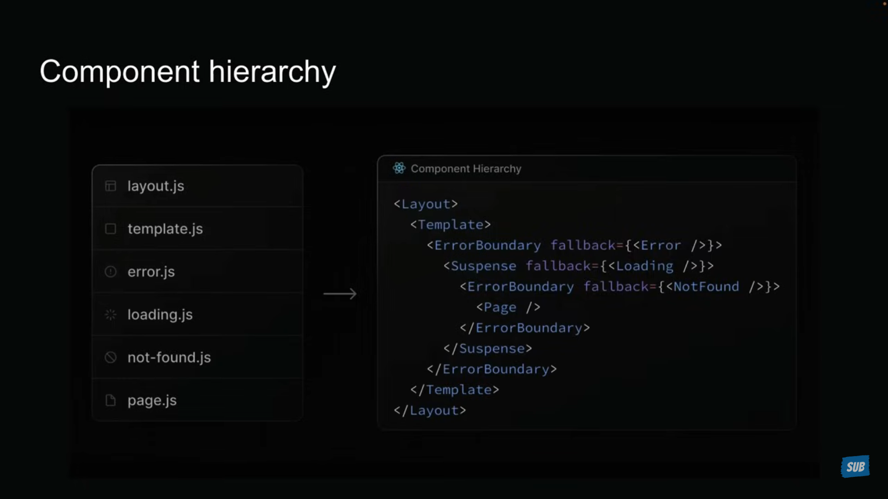

# Day 1

## Routing

Next.js has a file system based routing system.

URLs you can access in your browser are determined by how you orgainze your file and folders in your code.

### Routing conventions

1. All routes must live inside the app folder
2. Route files must be named either page.js or page.tsx

   When these conventions are followed , the file automatically becomes available as a route.

### Dynamic Routes

create a folder with square brackets `[productId]`. Inside it create a page.js. Inside page.js component grab the product id using params prop to show dynamic content.

eg. `page.js`

```javascript
export default async function ProductDetails({ params }) {
  const productId = (await params).productId;
  return <h1>Product details about {productId}</h1>;
}
```

### Nested Dynamic Routes

create a nested folder inside [productId] name it , anything `xyz`, inside `xyz` create another folder `[reviewId]`, create a `page.js` and do this :

```javascript
export default async function ProductReview({ params }) {
  const { productId, reviewId } = await params;

  return (
    <h1>
      Product review {reviewId} about {productId}
    </h1>
  );
}
```

### Catch All Segments

inside app folder create a folder `docs` inside it create a folder `[...slug]`. inside it create create a `page.js`, when you go to any url , it will show the same page. For customization :

```javascript
export default async function Docs({ params }) {
  const { slug } = await params;
  if (slug?.length === 2) {
    return (
      <h1>
        docs for feature{slug[0]} and concept {slug[1]}
      </h1>
    );
  } else if (slug.length === 1) {
    return <h1>Viewing docs for feature {slug[0]}</h1>;
  }
}
```

> to make slugs optional and showing a default page for docs only : `[[...slug]]` : ` return <><h1>Docs home page</h1></>` at end of component function

### Not Found Page

1. create a file in app folder named exactly like this : `not-found.js`.

2. Another way is to use `notFound` function from `"next/navigation"` and trigger it on specific condition you want :

```javascript
import { notFound } from "next/navigation";

export default async function ProductReview({ params }) {
  const { productId, reviewId } = await params;
  if (parseFloat(reviewId) > 1000) {
    notFound();
  }
  return (
    <h1>
      Product review {reviewId} about {productId}
    </h1>
  );
}
```

3. One more, if you want to create a custom not found page, like for product reviews, limiting them upto 1000, create another `not-found.js` in that folder and customize it.

> we can't use props in not found component , to use custom message based on route, we have to use react `usePathname` hook.

```javascript
"use client";
import { usePathname } from "next/navigation";

export default function NotFound() {
  const pathname = usePathname();
  const productId = pathname.split("/")[2];
  const reviewId = pathname.split("/")[4];
  return (
    <>
      <h2>
        Review {reviewId} not found for product {productId}
      </h2>
    </>
  );
}
```

#### File Colocation

A route only becomes public when it has a `page.js` or `page.tsx` file. It has to be defaulted export component by page.js

#### Private Folders

- A way to tell Next.js that it is a internal stuff and don't include it in routing system. The folder and all its sub-folders are excluded from the routing.
- Just add an underscore before folder name : `_stats`.
- If you want to add an underscore in url, in place of underscore use : `%5F`

### Route Groups

Logically organizing our routes without affecting the url.

- like there are 3 routes : login , register and forgot-password. To group them , create a new folder named auth and surround it wiht paranthese : `(auth)`.
- Move all routes to this folder. This tells Nextjs to treat it as a organizational folder only.
- We can nest them also

---

## Layouts

- Pages are route-specific UI Components, but a layout is UI that is shared between multiple pages in app.
- To create a layout, export a React component from a layout.js or layout.tsx. That component takes a children prop, which Nextjs will populate with your page content.
- To add header and footer, i did this : created a layout folder : `_layout` and make two folders inside it - header and footer, create their page.js. Then import them in root layout.js

### Nested Layouts

To create custom layout for any component, like for product page, create a `layout.js` inside product folder and style it.

### Multiple Root Layouts

coming soon ..

### Routing Metadata

- The Metadat API is a powerful feature that lets us define metadata for each page.
- Metadata ensures our content looks great when it's shared or indexede by search engines.
- Two ways to handle metadata in layout.js files :

  1. export a static metadata object
  2. export a dynamic generate metadata function.

- **Rules**

  - Both layout and page files can export metadata. Layout metadata applies to all its pages, while page metadata is specific to that page.
  - Metadata follows a top-down order, starting from the root level.
  - When metadata exists in multiple places along a route, they merge together, with page metadata overriding layout metadata for matching properties. Deeper layout takes priority.
  - Can't use both static and dynamic in same route segment.
  - Don't work with 'use client' pages. To use in client routes, create an another componet and shift client logic there, in page.js import that component and along wiht it use the metadata

- Static Metadata :

```javascript
export const metadata = {
  title: "This is about page",
  description: "description for about page",
};
```

- Dynamic Metadata :

```javascript
import { Metadata } from "next";
export const generateMetadata = async ({ params }) => {
  const id = (await params).productId;
  return {
    title: `Product ${id}`,
  };
};
```

---

### Navigation

Defining routes for our application's root, nested routes, dynamic routes and catch all routes.

### Link component navigation

For client side navigation, Next.js gives us the `<Link>` component.
The `<Link>` component is React component that extends `<a>` element.
To use it, we will need to import it from `'next/link'`.

> using `replace` keyword in `Link` tag, makes the current page to override history instead of adding a new one.

#### Active Links

Styling the Links that we are currently on. eg :

```javascript
"use client";

import Link from "next/link";
import { usePathname } from "next/navigation";
import "../global.css";

const navLinks = [
  { name: "Register", href: "/register" },
  { name: " Login ", href: "/login" },
  { name: " Forgot Password ", href: "/forgot-password" },
];
export default function AuthLayout({ children }) {
  const pathname = usePathname();
  return (
    <>
      <div>
        {navLinks.map((link) => {
          const isActive =
            pathname === link.href ||
            (pathname.startsWith(link.href) && link.href !== "/");
          return (
            <Link
              className={isActive ? "font-bold mr-4" : "text-blue-500 mr-4"}
              href={link.href}
              key={link.name}
            >
              {link.name}
            </Link>
          );
        })}
      </div>
    </>
  );
}
```

### Params and Search Params

_params_ is a promise that resolves to an object containing the dynamic route parameteres (like id)

_search params_ is a promise that resolves to an object containing the query parameters (like fikters and sorting)

while page.js has access to both params and search params, layout.js only has access to params.

using them :

1. using async await, works only in server component

   ```javascript
   export default async function NewArticles(params, searchParams) {

         const {articleId} = await params;
         const {lang='en'} = await searchParams;
   ```

2. using `use` hook, works only in client component
   ```javascript
   "use client";
   import { use } from "react";
   export default function NewArticles(params, searchParams) {
   const {articleId} = use(params);
   const {lang='en'} = use(searchParams);
   }  
   ```

### Navigating Programatically
There are some situations where we have to navigate through pages based on some actions and operations done by the user, like while on a ecommerce website when we have to navigate user toa page after succcessful completion of payment, we use navigation.

  - we can use `useRouter` hook to navigate user to other page, make it client component firstly. Then we can different methods, provided by router, like push, forward, backwards etc. Also we can navigate to dynamic routes, catch all routes etc.:
    ```javascript
    'use client'
     import { useRouter,redirect } from "next/navigation"

     export default function OrderProduct() {
          const router = useRouter();
          const handleClick = () => {
                    console.log("placing your order")
                    setTimeout(() => {
                     // router.push('/');    // -- using router
                        redirect('/')       //  -- using redirect
                    }, 3000);
          }

        return (
          <>
         <h1> product lazeez</h1>
         <button onClick={handleClick} className="m-2 p-2 rounded-xl bg-amber-900">buy now</button>
          </>
          )
      }
      ```
  - we can also use `redirect` from navigation to redirect to a page on conditions.:
      ```javascript

### Templates
  > Suppose we have a common *layout file* in a folder and that is shared across many folders, when we navigate between those routes, only the new page content will be mounted , *the common elements will be kept intact*, such as the state.

  Sometime we don't want this functionality in our app, like we want to use some hooks or some animatons on enter and exit, layout will not provide this functionality so we have to use templates.

 - Templates are similar tolayouts in that they are also shared UI between multiple pages in your app. Whenevr a user navigates between routes sharing a template, you get a completely freh start.
     - a new template component instance is mounted
     - DOM elements are recreated
     - state is cleared
     - effects are re-synchronized

Steps To Create a Template File : 
1. Create a `template.js` or `template.tsx` file and export a default React component from it.
2. Like layouts, templates need to accept a children prop to render the nested route segments.

- We can use both layout and template together. First layout will render and its children will be replaced by template components output.

### Loading UI

  `loading.js`
  This file helps us create loading states that users see while waiting for content to load in specific route segement. It appears instantly when navigating, letting users know that the application is responsive and actively loading content.
  - users can still use navigation menus or sidebars even if the main content is not ready 

### Error Handling
    To handle errors and to display some message on error occurence, to do this just simply create a `error.js` in the folder component where you want.
    Customize it as per your choice.

  > error boundary must be client component.
  - it automatically wraps route segments and their nested children in a React Error Boundary.
  - We can create custom Error Uis for specific segments using the file-system hierarchy.
  - Enable to attempt to recover from an error without requiring a full page reload.

  

  - To recover from an error, we have a `reset` function:
   ```js
  "use client";
  import { useRouter } from "next/navigation";
  import { startTransition } from "react";
  export default function ErrorBoundary({ error, reset }) {
          const router = useRouter();
          const reload = ()=>{
                    startTransition(()=>{
                              router.refresh();
                              reset();
                    })
          }
   ```

#### Handling errors in nested routes
  - Errors always bubble up to find the closest parent error boundary
  - An error.js file handles errors not just for its own folder, but for all the nested child segments below it too
  - BY strategically placing error.js files at different levels in your route folders, you can control exactly how detailed your error handling gets
  - Where you put your error.js file, makes a huge difference - it determines exactly which parts of your UI get affected when things go wrong.

#### Handling errors in layouts
  - The error boundary won't catch errors thrown in Layout.js within the same segment because of how compponent hierarchy works,
  - The layout actually sits above the error boundary in the component tree.
  
  eg.: product-> parent component
       [productId] -> child component

  *if both `layout.js` and `error.js` are in child component folder it will not catch error and `Unhandled Runtime error` will be encountered. To make this work properly, move the `error.js upto parent component.*

#### Handling Global Errors
- if an error boundary can't catch errors in the layout.js file from same segment? For these we have a special file called `global-error.js` that goes in your root app directory.
- This is last line of defense when something goes catasphorically wrong at the highest level of your app.
  - works only in production mode
  - requires html and body tags to be rendered. Try to write html and css only , here.

### Parallel Routes
It is a way to render multiple pages simultaneously within the same layout.

- Parallel routes are defined using a feature known as **slots**, that helps organize content in a modular  way.
- To create a slot, we use `@folder` naming convention.
- Each defined slot automatically becomes a prop in its corresponding `layout.js` file.

***Use Cases***
- Dashboards with mutiple sections.
- Split-view interfaces.
- MUlti-pane layouts
- Complex admin interfaces

#### Unmatched Routes

- **Navigating from the UI** 
    When navigating through the UI (like clicking links), Next.js keeps showing whatever was in the unmatched slots before.
- **Page Reload**
    Next.js looks for a `default.js` file in each unmatched slot. This file is critical as it serves as a fallback to render content when the framework cannot retrieve a slot's active state from the current URL.
    Without the file, we get a 404 error

#### Conditional Routes
  - Imagine we want to show different content based in  whether the user has signed in or not.
  - You might want to display a dashboard for authenticated users but show a login page for those who aren't 
  -  Conditional routes allows us to achieve this while maintaining completely seperate code on the same URL.    
  
 #### Intercepting Routes
 - It allows to load a route from another part of your application within the current layout.
 - It's particularly useful when you want to display new content while keeping your user in the same context.

  ***Conventions***
  - `(.)` to match segments on the same level, prefix to folder name.
  - `(..)` to match segments one level above. 

