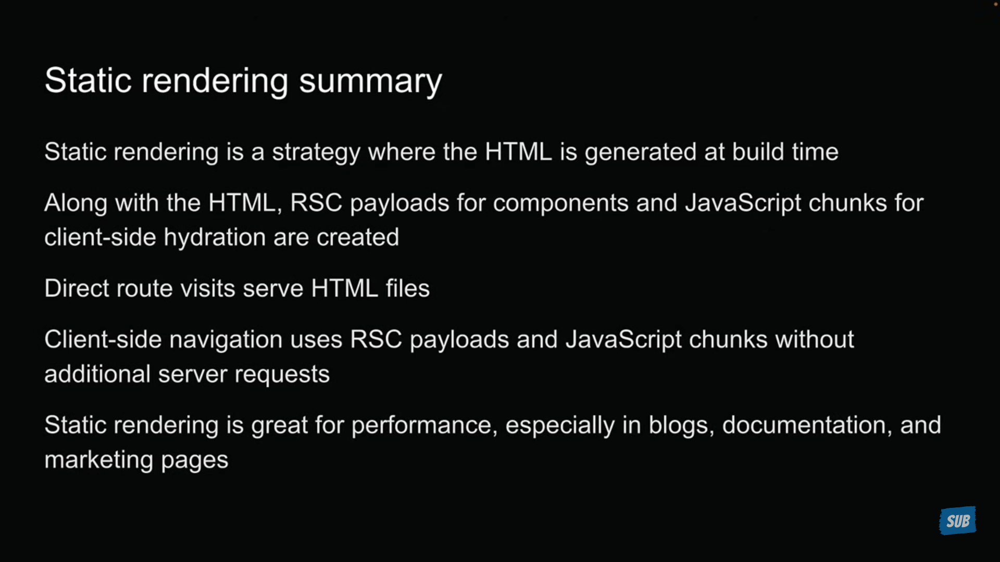
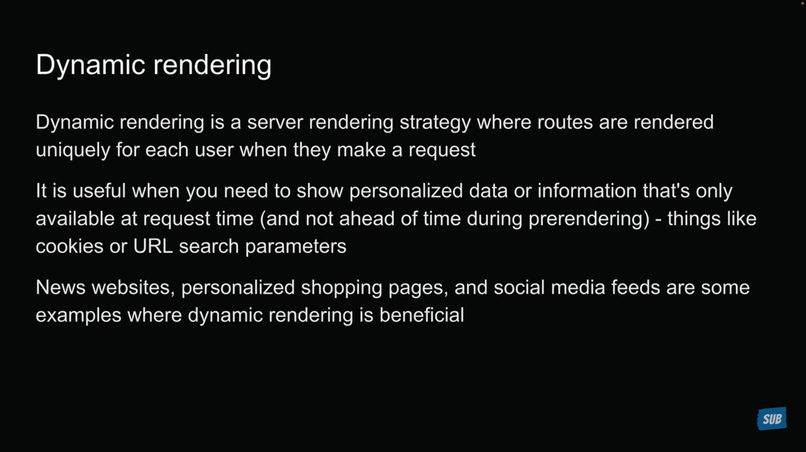
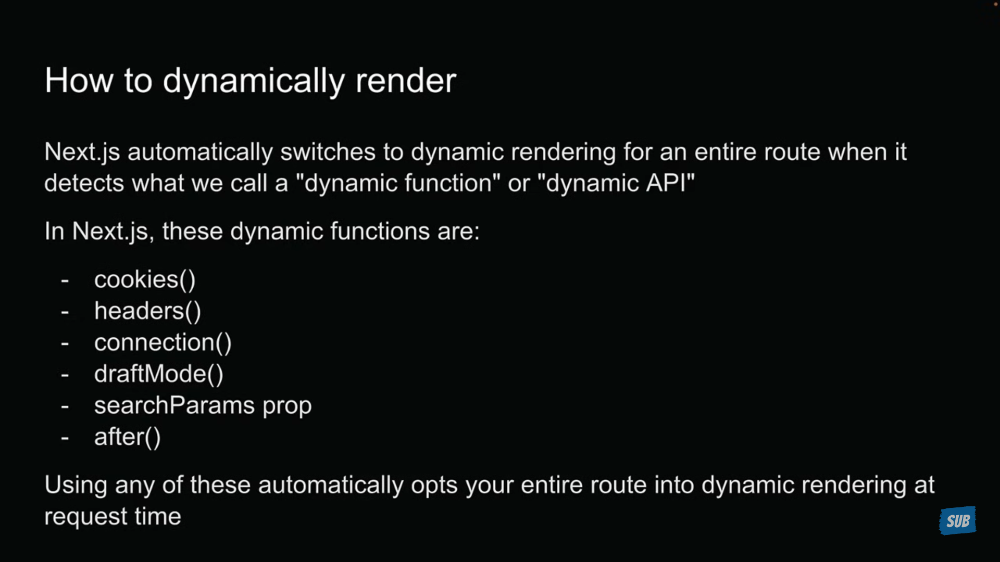
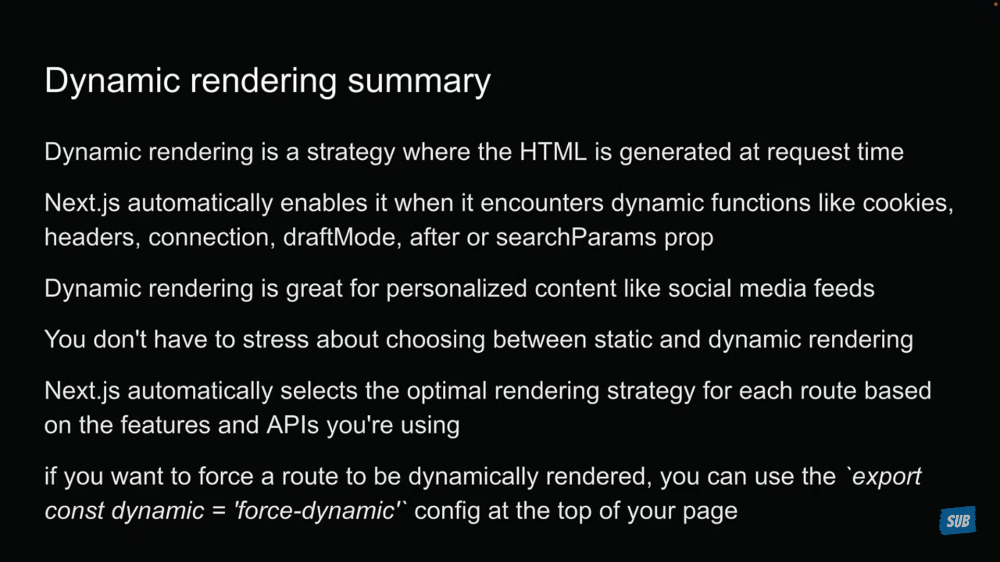

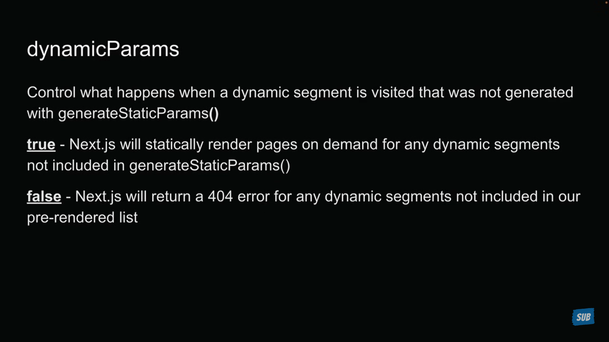
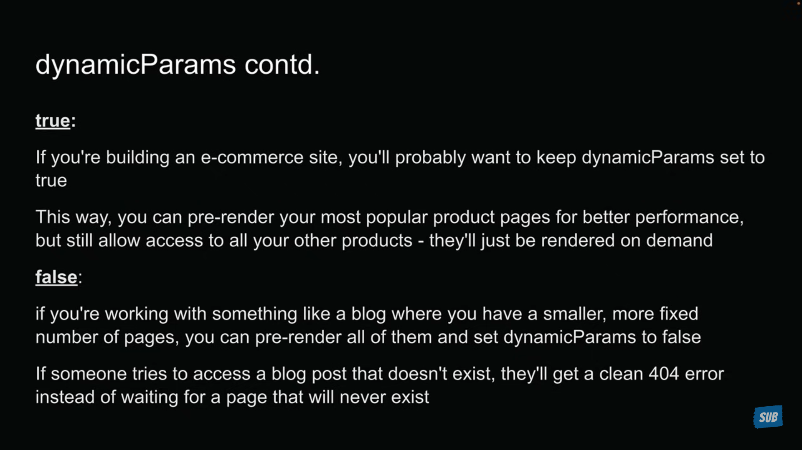
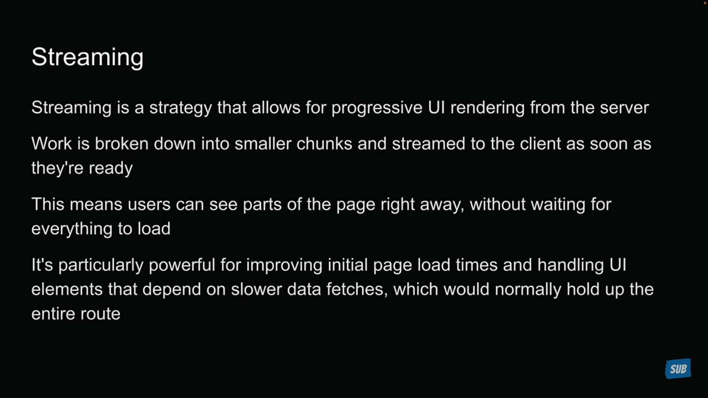

```js
import { Suspense } from "react";

import { Product } from "@/components/product";
import { Reviews } from "@/components/reviews";

export default function ProductDetailPage() {
  return (
    <div>
      <h1>Product detail page</h1>
      <Suspense fallback={<p>Loading product details...</p>}>
        <Product />
      </Suspense>
      <Suspense fallback={<p>Loading reviews...</p>}>
        <Reviews />
      </Suspense>
    </div>
  );
}
```

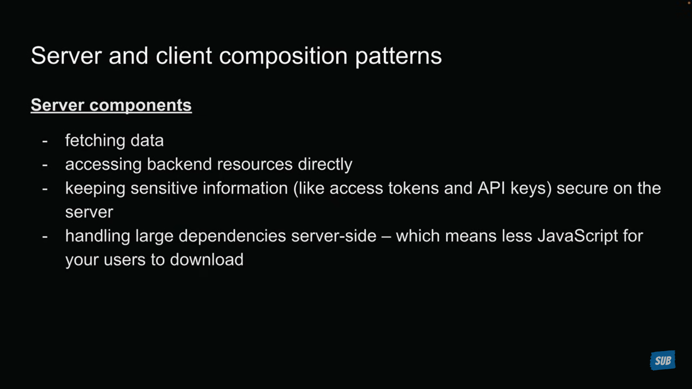
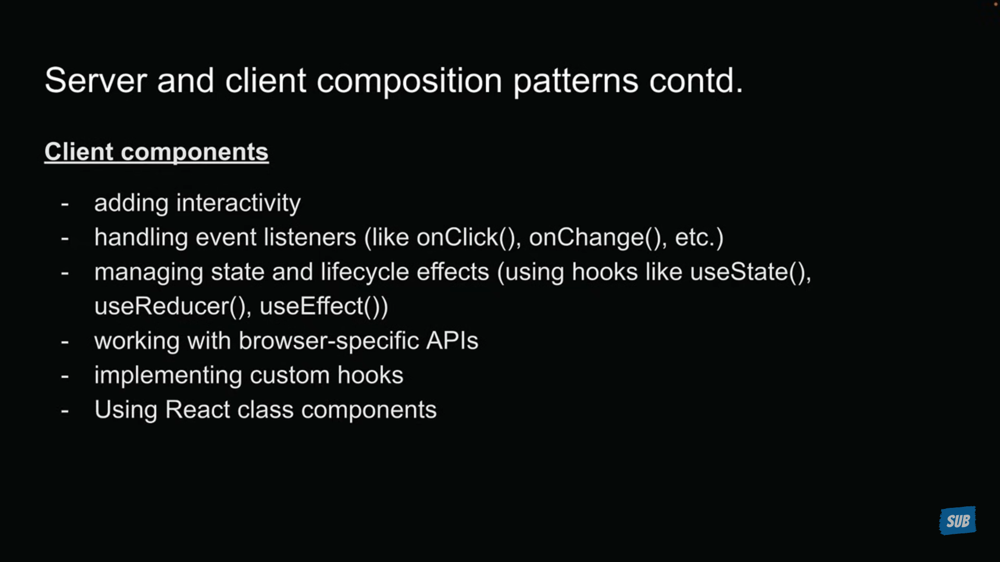


> To prevent the server code being exposed to client side, we use `server-only` package. To use this, just install it and import it in the file whee is your secure server logic.

> Some packages are still dependent on client component features, to use them in a server component, create a client component with those packages and import and use those client components in server components.


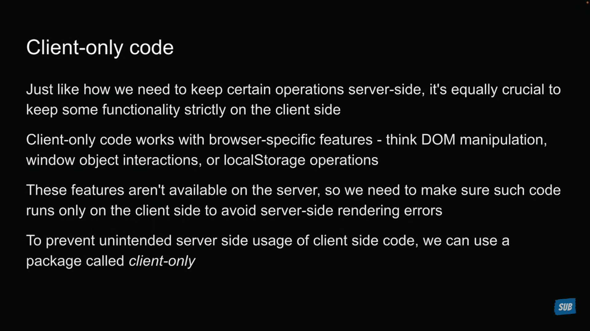
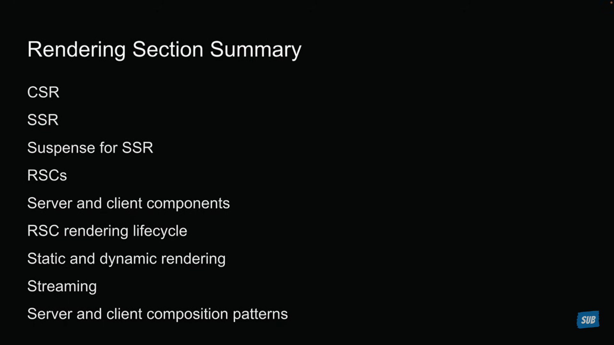

